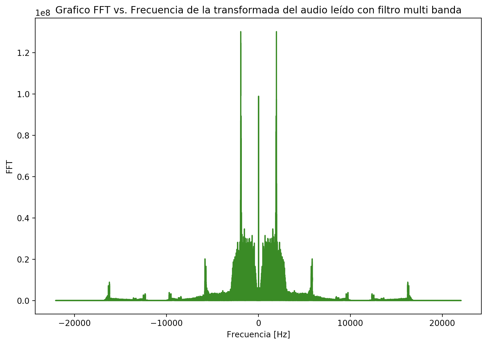
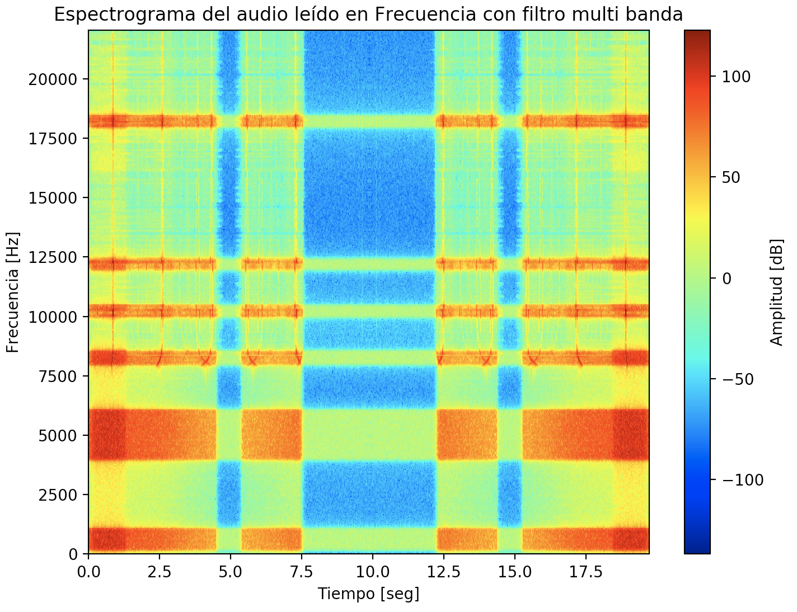

# Laboratorio: Transmisión de datos entre computadoras (variación transmisión de imagen vía cable de audio).

Proyecto semestral de laboratorio para la asignatura de Redes de Computadores 2°Semestre del 2018. Grupo N°3.

## Integrantes
- Carlos Alvarez
- Sebastián Pasutti
- Alberto Pizarro

## Indice

- [Etapa 1: Análisis  de señales](#etapa-1-an%C3%A1lisis--de-se%C3%B1ales)
  - [Objetivos](#objetivos)
  - [Caracteristicas de la entrega](#caracteristicas-de-la-entrega)
  - [Análisis de resultados](#an%C3%A1lisis-de-resultados)
  - [Tecnología utilizada](#tecnolog%C3%ADa-utilizada)
      - [Software](#software)
      - [OS](#os)
  - [Modo de uso](#modo-de-uso)

## Etapa 1: Análisis  de señales

La transformada de Fourier es una transformación matemática de una función en base al tiempo a otra función en base a la frecuencia, con aplicaciones para el envío y tratamiento de datos. Un ejemplo práctico de esto se da
en los radiotelescopios que reciben ondas de radio que representan el aspecto y estado del firmamento en un lugar determinado, con un alcance superior a cualquier telescopio óptico existente.

### Objetivos
El objetivo que nos fue entrega corresponde a crear un programa en el lenguaje de programación Python, que sea capaz de analizar y procesar señales en el dominio del tiempo y en el de la frecuencia.

Específicamente, se nos pide crear:
>1.-Módulos para leer y grabar archivos.

>2.-Módulos para graficar transformadas de fourier y espectrogramas.

>3.-Módulos para aplicar filtros digitales a señales de audio.

>4.-Documentación de experimentos realizados y sus resultados.

Como material para probar nuestros programas, se nos proveyó de archivos de audio de comunicaciones reales y otros simulados que debieron ser analizados para eliminar el ruido y aquellas bandas inaudibles.

### Caracteristicas de la entrega
  - Se implementa la función **leer audio** que obtiene y almacena un audio en formato *.wav* para futuro uso.
  - Se implementan las funciones para graficar los datos obtenidos por los audios.
  - Se implementan funciones para generar filtros pasa baja, pasa alta y pasa banda.

### Análisis de resultados

Estos son los gráficos obtenidos al analizar el audio original obtenido:

Estos son los gráficos obtenidos al pasar el audio original a través de un filtro pasa baja:

Estos son los gráficos obtenidos al pasar el audio original a través de un filtro pasa alta:

Estos son los gráficos obtenidos al pasar el audio original a través de un filtro pasa banda:

Estos son los gráficos obtenidos al pasar el audio original a través de un filtro multi pasa banda:

### Tecnología utilizada
Se utilizaron las siguientes tecnologías y librerías para construir el proyecto:

##### Software
* [PyCharm](https://www.jetbrains.com/pycharm/download/#section=linux) - IDE especializado en proyectos de Python
* [Python 3.0](https://www.python.org/download/releases/3.0/)  - Lenguaje de programación
* [NumPy](http://www.numpy.org/)   - Librería Python para calculo matricial y análisis cientifico
* [SciPy](https://www.scipy.org/) - Librería Python para computación científica y técnica
* [PIL](https://pypi.org/project/PIL/) - Librería python para manejo especializado de imagenes
* [Matplotlib](https://matplotlib.org/) - Librería Python para feneración de gráficas

##### OS

Programas probados en:
* MacOS Mojave
* Ubuntu 18.04
* Linux Mint 19 Cinnamon 3.8.9

### Modo de uso

El programa requiere tener instaladas las librerías anteriormente mencionadas junto con Python 3.6 o superior. Para su ejecución, seguir los los pasos descritos a continuación:

- Ejecutar el programa por línea de comandos, por ejemplo:

        alberto@Note-CX61-2QF:~/Documentos/Redes/LAB 1$ python3 Lab-1.py

- Aparecerá un mensaje como este:

        Ingrese la ruta del archivo .wav:

- Una vez escrito el nombre, presione el botón ENTER para ejecutar el programa:

        Ingrese la ruta del archivo .wav: ook.wav
- Aparecerá una ventana con una gráfica de Amplitud vs Tiempo del archivo proveído
- Al cerrarla, aparecerá una gráfica Amplitud vs Frecuencia de la Transformada de Fourier de la señal proveída
- Luego de cerrar esta, se muestra la linealidad de la Transformada de Fourier al gráficar el paso inverso, es decir, al aplicar la antitransformada y volver a la función original
- Finalmente, el último gráfico que aparece luego de cerrar el anterior corresponde a ser un espectrograma de la transformada de la función leída
